# The forests lost GDP — what do they use instead? {.divider background-color="#2874A6"}

[Act I]{.act}

## Three methods found no inverted-N — yet flexible forests "lose" GDP

The project's BMA and Double-Selection LASSO fits put the cubic discriminant **below zero** (about −0.011 to −0.016): PM2.5 falls with income, with no inverted-N.

. . .

A flexible **Random-Forest Double ML** collapsed that discriminant to about zero (+0.0077 and +0.0008). The reason: the 20 controls predict GDP almost perfectly (nuisance $R^2 \approx 0.95$). They behave like GDP's mediators and absorb its signal.

[The trees did not find an inverted-N — they stopped seeing GDP. So what are they looking at?]{.takeaway .fragment}

::: {.notes}
c11 BMA discriminant −0.0163 (UIP) / −0.0160 (Robust); c21 DSL −0.011 to −0.015 across five penalties. c22 RF-DML: Variant A +0.0077 (p = 0.064), Variant B +0.0008 (p = 0.60), both with the flipped (+,−,−) sign pattern — an over-control artifact, not a turning point. Regularizing the forest restored −0.0152. This deck opens the same forests with SHAP.
:::

## Three questions for SHAP

::: {.incremental}
- **Drivers:** which predictors carry the forest's PM2.5 predictions — and where does GDP rank?
- **Income groups:** does the answer change between poor and rich provinces?
- **Shape:** does the forest's attribution to GDP bend into an inverted-N anywhere?
:::

[Same fitted forests as c22 — we only change how we look at them.]{.takeaway .fragment}

::: {.notes}
Descriptive, predictive attribution — not causal. Three forests refit on the full 527-observation panel with c22's exact hyperparameters and seed 42; all c22 reference numbers reproduce (largest R² gap 0.0004). Quintiles are province quintiles by 2004–2020 mean ln GDP per capita.
:::

## GDP ranks 19th of 23 features in the PM2.5 forest

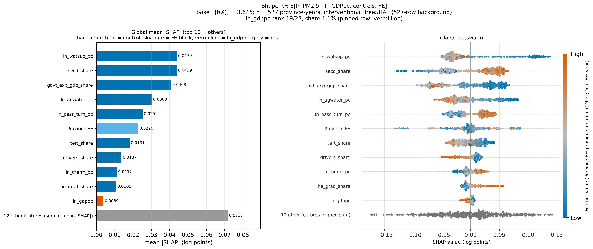

[GDP's typical attribution is 0.0039 log points — about 0.16 μg/m³, an eleventh of the top feature.]{.takeaway .fragment}

::: {.notes}
Spoiler slide. ln_gdppc: mean |SHAP| 0.003861 log points, 1.15% of total attribution, rank 19 of 23 (near-tie with utility-model patents at 0.003851). Across all 527 province-years its attribution stays within −1.8% to +0.8% of PM2.5. The leaders: water supply per capita 13.1%, secondary-industry share 13.1% (a numerical tie), government-expenditure share 12.1%, agricultural water 9.0%, passenger turnover 7.5%, Province FE block 6.8%.
:::

# Opening the forests with SHAP {.divider background-color="#0072B2"}

[Act II]{.act}

## SHAP splits every prediction into additive feature credits

$$f(x_i) \;=\; \phi_0 \;+\; \sum_{j=1}^{M} \phi_{ij}, \qquad \phi_0 = \mathbb{E}\,[f(X)]$$

[Interventional TreeSHAP: each credit $\phi_{ij}$ averages the feature's marginal contribution over coalitions, filling absent features from all 527 province-years. Credits are in log points of the model's target.]{.comment}

. . .

- The 30 province and 16 year dummies are summed into **Province FE** and **Year FE** blocks (exact by additivity).
- Path-dependent TreeSHAP is run as a global check. All additivity identities hold to below $10^{-7}$.

[Every attribution is a statement about the fitted forest, not a causal effect.]{.takeaway .fragment}

::: {.notes}
Base value φ₀ = 3.646 log points (38.3 μg/m³), exactly the mean in-sample prediction. Pitfall avoided: shap's default masker silently subsamples the background to 100 rows; the script passes all 527 and asserts it. FE blocks are lower bounds on province/year heterogeneity — the forest also identifies provinces through near-time-invariant controls. The forests are overfit in-sample (R² ≈ 0.91 vs 0.81 out-of-bag), so SHAP explains fitted noise too.
:::

## Three forests, one question each

:::: {.columns}
::: {.column width="33%"}
### Shape RF
- ln PM2.5 on ln GDPpc + 20 controls + FE
- 1,000 trees
- *Where does GDP rank?*
- in-sample $R^2$ 0.91
:::
::: {.column width="33%"}
### GDP-nuisance RF
- ln GDPpc on 20 controls + FE
- 500 trees (Variant A)
- *What rebuilds GDP?*
- in-sample $R^2$ 0.98
:::
::: {.column width="34%"}
### Outcome-nuisance RF
- ln PM2.5 on 20 controls + FE
- 500 trees, no GDP
- *What predicts PM2.5 without GDP?*
- in-sample $R^2$ 0.91
:::
::::

[Comparing the three forests reveals over-control from the prediction side.]{.takeaway .fragment}

::: {.notes}
All three refit with c22's hyperparameters (min_samples_leaf 5, max_features sqrt, seed 42). The GDP-nuisance forest even predicts GDP for an entirely unseen province (province-block R² 0.92); the PM2.5 forests do not (0.30), which measures new-province prediction, not explanatory power.
:::

## Province quintiles fix each province's income group for 17 years {.smaller}

| Quintile | Provinces | Median province | GDPpc, geometric mean (yuan) | East / Central / West |
|---|---:|---|---:|:---:|
| Q1 | 7 | [Yunnan]{.key} | 16,735 – 24,792 | 0 / 1 / 6 |
| Q2 | 6 | [Jilin]{.key} | 24,899 – 26,826 | 1 / 3 / 2 |
| Q3 | 6 | [Hebei]{.key} | 26,912 – 30,195 | 1 / 3 / 2 |
| Q4 | 6 | [Liaoning]{.key} | 33,123 – 47,029 | 3 / 1 / 2 |
| Q5 | 6 | [Jiangsu]{.key} | 49,170 – 90,121 | 6 / 0 / 0 |

[Provinces are ranked by mean ln GDPpc. The quintiles mix income with geography: Q1 is 6/7 Western, Q5 is all Eastern.]{.takeaway .fragment}

::: {.notes}
Members — Q1: Guizhou, Gansu, Guangxi, Yunnan, Tibet, Qinghai, Heilongjiang. Q2: Jiangxi, Sichuan, Jilin, Anhui, Ningxia, Hainan. Q3: Henan, Shanxi, Hebei, Hunan, Xinjiang, Shaanxi. Q4: Hubei, Chongqing, Liaoning, Inner Mongolia, Shandong, Fujian. Q5: Guangdong, Zhejiang, Jiangsu, Tianjin, Shanghai, Beijing. 119 / 102 / 102 / 102 / 102 province-years. Q2 and Q3 are packed tightly (a 21% income range together; Hainan and Henan differ by 0.003), so Q2–Q3 contrasts are about which provinces sit there. Year by year the quintiles overlap heavily on the GDP axis (Q1 reaches 52,280 yuan; Q5 starts at 19,790). Per-quintile SHAP importance is distance from the national 527-row background, not importance within the quintile.
:::

## Interventional and path-dependent SHAP agree ($\rho \approx 0.99$)

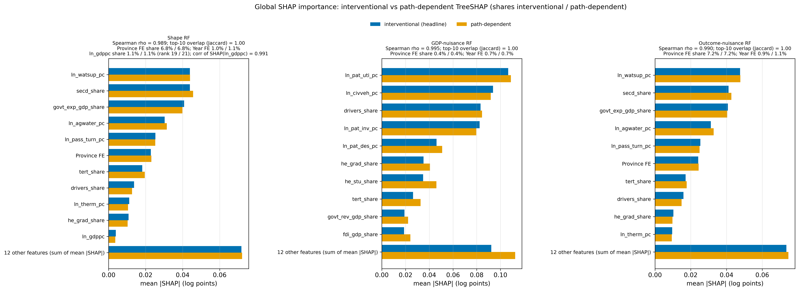

[The global rankings do not depend on how correlated features are handled — but agreement is not identification.]{.takeaway .fragment}

::: {.notes}
Spearman ρ 0.989 / 0.995 / 0.990 over grouped features; identical top-10 sets; FE shares move by at most 0.12 pp; SHAP(ln_gdppc) correlates 0.991 across explainers. Only near-tied neighbours swap (the shape RF's tied top pair; GDP 19 → 21). Five-seed path-dependent refits keep ρ ≥ 0.976 with GDP at ranks 19–22.
:::

# GDP stays on the margins — everywhere {.divider background-color="#D55E00"}

[Act III]{.act}

## GDP stays marginal in every income quintile (rank 18–21)

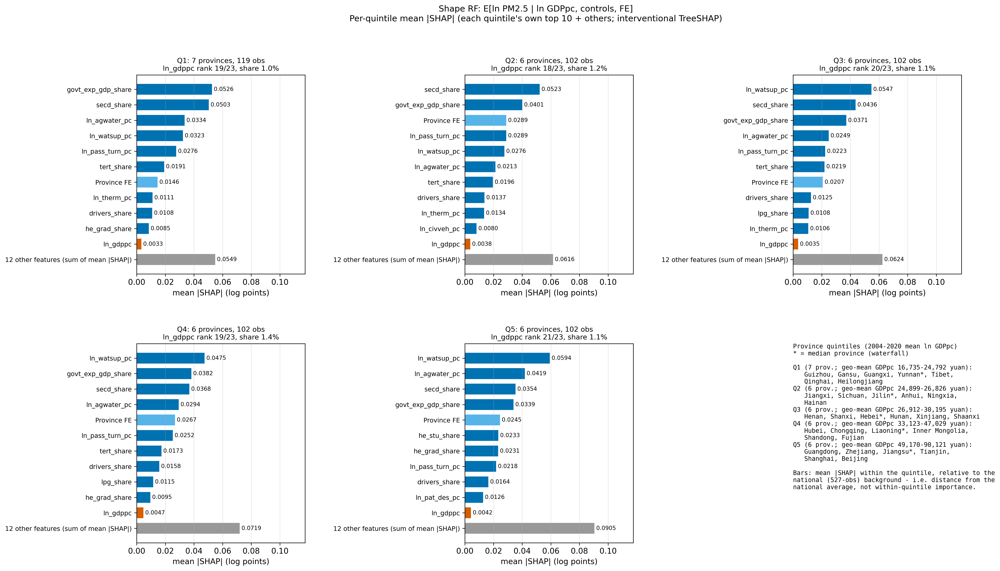

[From the poorest to the richest provinces, GDP never holds more than 1.4% of the attribution.]{.takeaway .fragment}

::: {.notes}
ln_gdppc rank 19 / 18 / 20 / 19 / 21 and share 1.0% / 1.2% / 1.1% / 1.4% / 1.1% in Q1–Q5. Leaders shift: fiscal and industrial structure (govt-expenditure share, secondary share) lead Q1–Q2; water supply per capita leads Q3–Q5. Mean signed SHAP(ln_gdppc) moves from +0.0014/+0.0008/+0.0016 (Q1–Q3) to −0.0012/−0.0029 (Q4–Q5).
:::

## Quintile pollution gaps are attributed to structure, water and province — not GDP

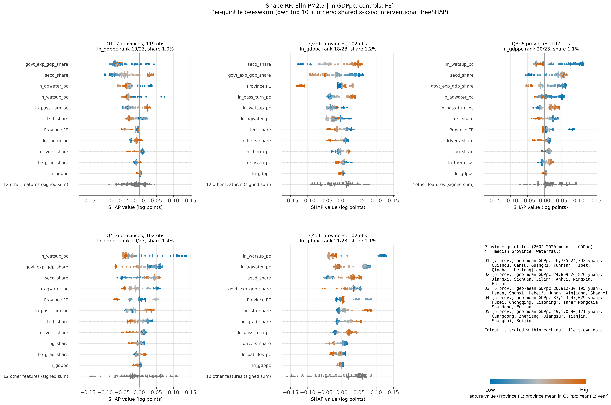

[Predicted PM2.5 (geometric mean) Q1–Q5: 31.0 · 34.8 · **46.6** · 39.3 · 43.4 μg/m³, not monotone in income. GDP ranks 19 · 18 · 20 · 19 · 21.]{.comment}

[Structure, water and province carry 72–89% of the quintile gaps. GDP carries at most 0.003 log points.]{.takeaway .fragment}

::: {.notes}
Gaps from the national baseline (38.3 μg/m³) run −0.21 to +0.20 log points. Industrial, fiscal and tertiary shares, the two water variables and the Province FE block carry 72%–89% of the gap in Q1, Q2, Q3 and Q5; Q4's small gap (+0.025) is offsetting terms. This is an attribution of the fitted forest, not a causal decomposition: quintiles mix income with geography, and the controls can stand in for GDP in prediction.
:::

## In every median province, GDP moves predicted PM2.5 by less than 0.4%

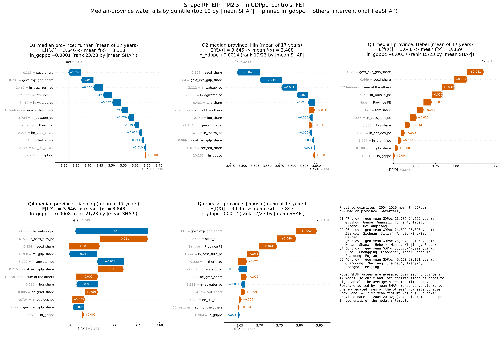

[Yunnan sits 28% below baseline and Jiangsu 22% above it. GDP's share of either gap is negligible.]{.takeaway .fragment}

::: {.notes}
Yunnan: 3.646 → 3.318 (38.3 → 27.6 μg/m³); its three largest attributions (low industrial share −0.054, high fiscal share −0.052, light passenger transport −0.040) sum to 44% of the gap; ln_gdppc +0.0001, rank 23 of 23. Hebei +25% (govt-exp +0.041, secd +0.032; GDP +0.0037, rank 15). Jiangsu +22% (govt-exp +0.052, secd +0.048, Province FE +0.044; GDP −0.0012). 17-year averages cancel opposite-signed early/late contributions; rows are sorted by size, so the aggregated "others" row can sit mid-stack.
:::

## No inverted-N in any quintile's SHAP(GDP) curve

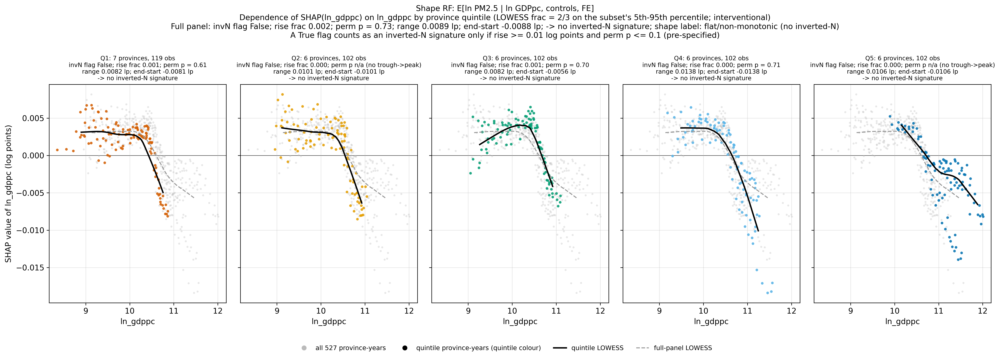

[Every curve ends lower than it starts, by 0.6%–1.4% of PM2.5. None rises again.]{.takeaway .fragment}

::: {.notes}
Full panel: flat to a peak near 21,900 yuan, then declining, crossing zero around 40,000 yuan — the flat-then-declining shape of c22's PDP/ALE. End − start: full panel −0.0088 log points (−0.9%); quintiles −0.0056 to −0.0138. Each facet's points trace province time paths (within-quintile correlation of ln_gdppc with year 0.87–0.98) — do not stitch the facets into a "piecewise EKC". Shape labels are reported for the full panel only (pre-specified): quintile labels flip with the bandwidth.
:::

## A False flag alone is weak evidence — the size of the decline is what stands out {.smaller}

| Subset | Pre-specified decision | End − start (log pts) | *Post hoc:* perm. p, decline |
|---|---|---:|---:|
| Full panel | no inverted-N | −0.0088 | [0.005]{.key} |
| Q1 | no inverted-N | −0.0081 | [0.005]{.key} |
| Q2 | no inverted-N | −0.0101 | [0.005]{.key} |
| Q3 | no inverted-N | −0.0056 | [0.005]{.key} |
| Q4 | no inverted-N | −0.0138 | [0.005]{.key} |
| Q5 | no inverted-N | −0.0106 | [0.005]{.key} |

[No inverted-N, but little power against a small one. The post-hoc decline test cannot separate income from the late-2010s fall in PM2.5.]{.takeaway .fragment}

::: {.notes}
Pre-specified rule: LOWESS frac 2/3 on a 5th–95th-percentile grid; c22's inverted-N flag (rise_tol 0.20, itself set post hoc in c22); 200 within-subset permutations; a True flag counts only if rise ≥ 0.01 log points and p ≤ 0.10. At the headline bandwidth 53.5%–76.5% of permuted-noise curves are also False, and the positive branch was out of reach for the full panel, Q1 and Q3 (curve ranges 0.008–0.009). Post hoc and descriptive only: every observed net decline exceeds all 200 permuted curves (p = 1/201) and the curves span 5–13× the median noise range — but the permutation also breaks the time link, so within quintiles the decline cannot be told apart from the common post-2014 fall in PM2.5.
:::

## Patents and motorisation rebuild GDP (64.5%)

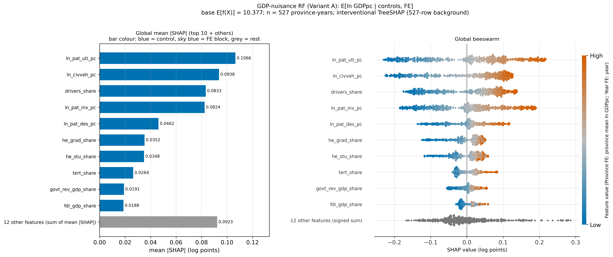

[The forest rebuilds GDP from patents, vehicles and drivers. The FE blocks get about 1%.]{.takeaway .fragment}

::: {.notes}
Utility-model patents 16.7%, civilian vehicles 14.7%, driver share 13.0%, invention patents 12.9%, design patents 7.2% — each almost perfectly monotone and positive (ρ = +0.986 to +0.995). Higher-education and tertiary shares add 15.1%; electricity and thermal power generation rank 12th/13th (4.5%). Province FE 0.4%, Year FE 0.7%. SHAP identifies the fitted proxies, not their direction: these indicators could be consequences of growth, trend proxies, or causes of it.
:::

## The patent–vehicle core holds in every quintile

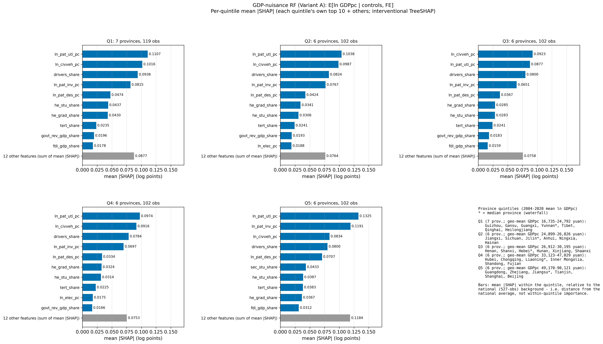

[The same four indicators lead every income group. Invention patents move up to second place in Q5.]{.takeaway .fragment}

::: {.notes}
Top four in every quintile: utility patents, civilian vehicles, driver share, invention patents (10%–17% each). In Q5 invention patents reach 15.0% (11.8%–12.6% in Q1–Q4) — mostly because the six Eastern Q5 provinces sit far above the national invention-patent level (median ln 3.02 vs 0.12–1.49 elsewhere), since per-quintile importance is distance from the national background.
:::

## Jiangsu's +72% GDP premium is attributed to patents

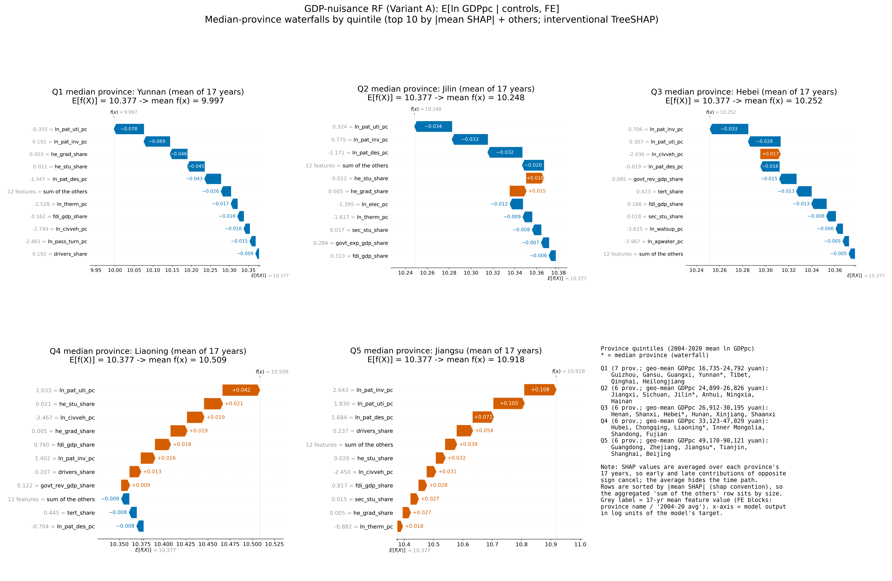

[Rich and poor median provinces differ in the forest's GDP mainly through patent intensity.]{.takeaway .fragment}

::: {.notes}
Jiangsu: 10.377 → 10.918 log units (32,120 → 55,150 yuan, +0.54 log points): invention +0.108, utility +0.105, design patents +0.071. Yunnan: 10.377 → 9.997 (−32%): patents −0.19 of the −0.38 log-point gap, higher-education shares −0.09.
:::

## GDP proxies trend within provinces; PM2.5 predictors mark provinces

:::: {.columns}
::: {.column width="50%"}
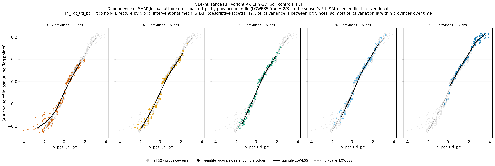
:::
::: {.column width="50%"}
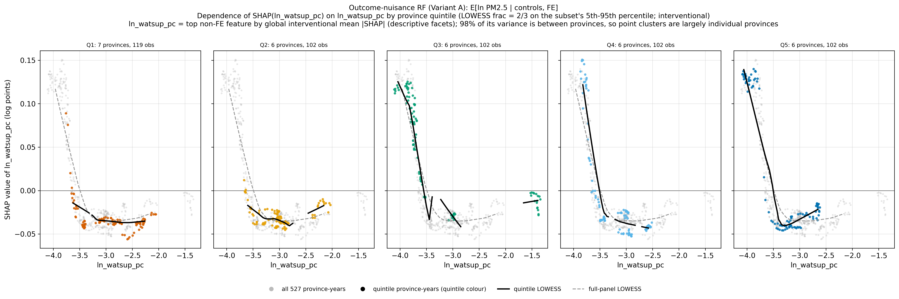
:::
::::

[Patents vary within provinces over time (42% between-province). Water supply is 98% between-province, so it acts as a province marker, not a mechanism.]{.takeaway .fragment}

::: {.notes}
Patents: attributions from −0.23 log points (−21% GDP) to +0.22 (+24%); quintile ranges overlap heavily (medians −0.32 to 2.28) and only Q5 is shifted to the upper half. Water supply: large positive attributions (up to +0.15) switch on below about −3.6 in ln_watsup_pc; six northern provinces (Beijing, Tianjin, Shandong, Shanxi, Henan, Shaanxi) supply 100 of the 109 province-years above +0.05. Gaps in the quintile LOWESS lines mark stretches with no data.
:::

## A PM2.5 forest without GDP looks the same

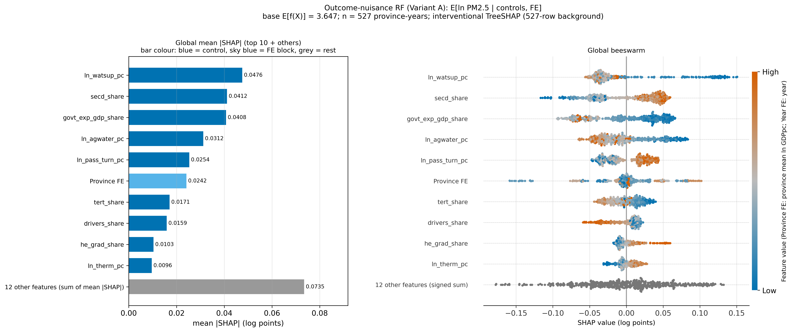

[GDP's leading proxies are mostly not PM2.5 predictors ($\rho = -0.41$, no shared top-5). Dropping GDP leaves the fit essentially unchanged.]{.takeaway .fragment}

::: {.notes}
Out-of-bag R² 0.8127 without GDP vs 0.8116 with it (500 vs 1,000 trees, so a similarity check, not a clean drop-one test). Spearman ρ between the GDP-nuisance and outcome-nuisance control rankings −0.41 (−0.49 against the shape RF); utility and invention patents rank 19–23 in the PM2.5 forests, although driver share ranks 8th. Consistent with c22's over-control reading: GDP's variation is absorbed by trend-heavy innovation and motorisation indicators — SHAP cannot show whether they are mediators, trend proxies or causes of growth.
:::

## The strongest objection — and the answer

[Objection.]{.objection} GDP looks peripheral only because its correlates (patents, vehicles, water, province identity) soak up its credit. SHAP cannot say that GDP does not matter.

. . .

[Response.]{.rebuttal} Agreed: these are **attributions of the fitted forest, not effects**, and the FE blocks are lower bounds. What SHAP does establish holds up:

- the global ranking is robust to the explainer ($\rho \approx 0.99$) and the seed ($\rho \geq 0.976$)
- GDP's leading proxies (patents) rank near the bottom of the PM2.5 forest
- the shape verdict (no inverted-N) matches BMA, DSL, PDP and ALE

[SHAP cannot price GDP's causal effect. It does show where the forest routes PM2.5 prediction, and that route bends nowhere.]{.takeaway .fragment}

::: {.notes}
Interventional SHAP evaluates off-manifold combinations across blocks (one province's dummy with another's water supply). A causal reading would need conditional ignorability of GDP given non-mediating controls, which neither c22 nor c30 tests. With income and time given equal flexibility (16 df each), income bins explain SHAP(ln_gdppc) better than year dummies (R² 0.71 vs 0.52), though most explained variation is shared.
:::

## Across forests, explainers and income groups, GDP stays peripheral {background-color="#2874A6"}

[1.1%]{.bignum}

[GDP's share of the PM2.5 forest's attribution: rank 19 of 23 overall, 18–21 in every income quintile, and no inverted-N signature in any of the 6 subsets]{.bignum-label}

# In the fitted forests, PM2.5 runs through structure and place; GDP stays peripheral and never bends into an inverted-N. {.divider background-color="#D55E00"}

[Next: SO₂ · COD · NH₃-N outcomes · 2SLS-BMA endogeneity · spatial models]{.act}
