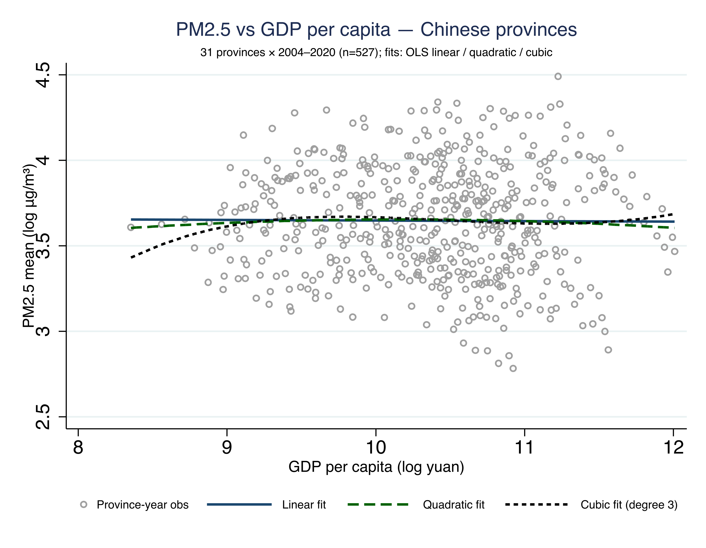
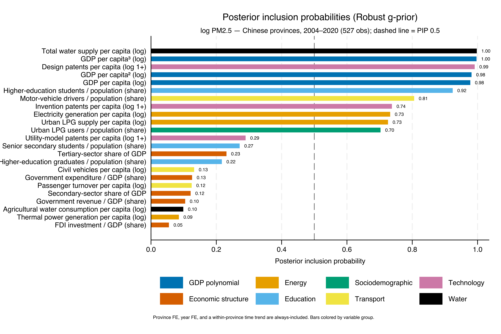
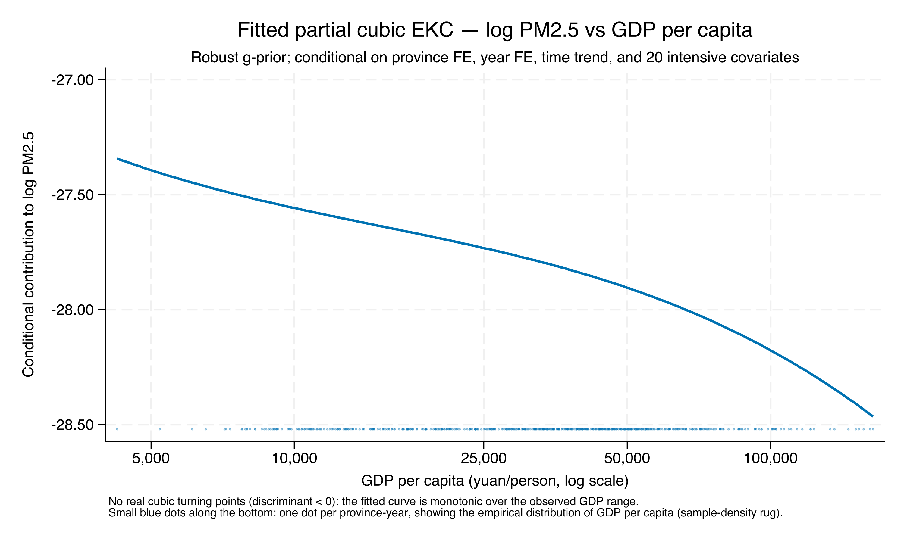
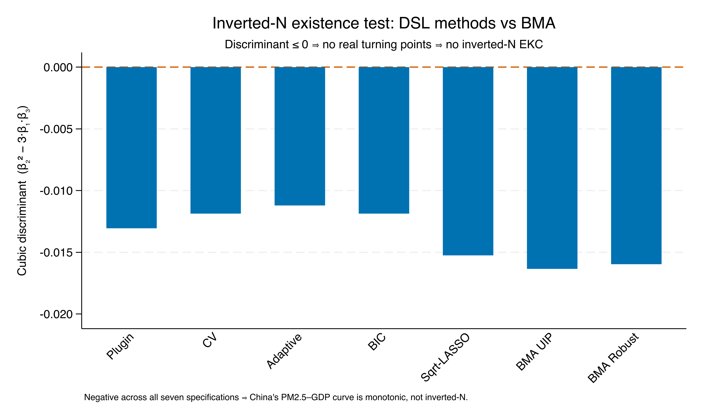
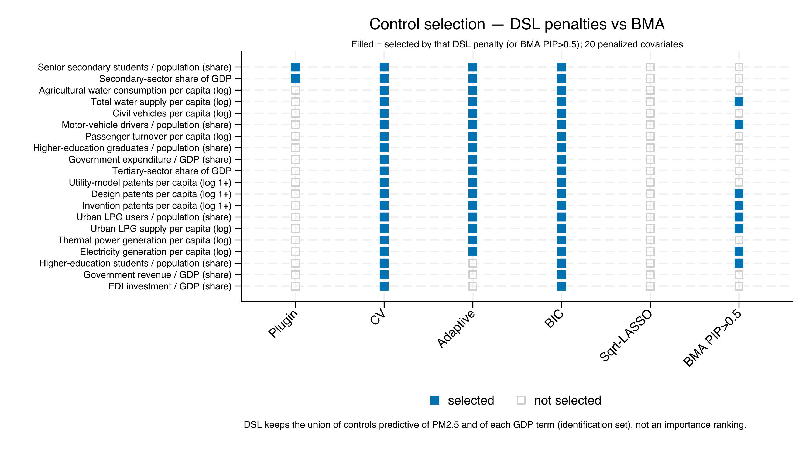
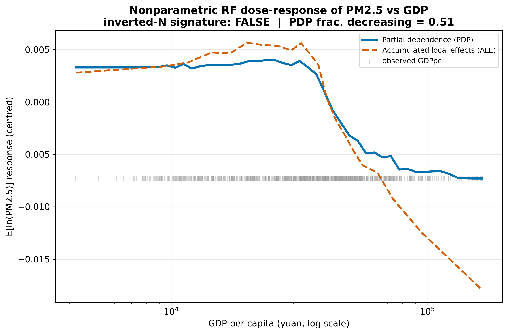
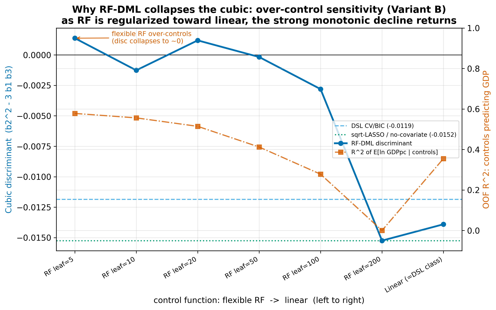
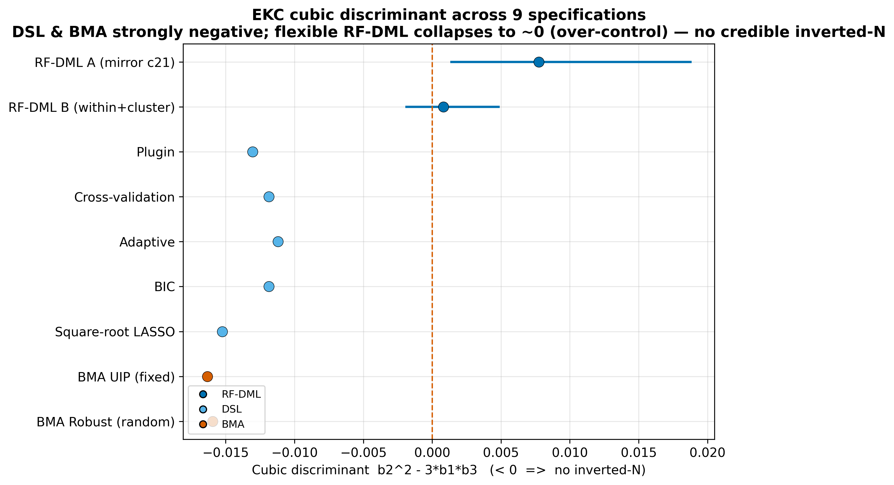

# The shape is the question {.divider background-color="#2874A6"}

[Act I]{.act}

## Across 84 countries, the EKC bends twice — an inverted-N

Gravina & Lanzafame (2025) re-estimate the Environmental Kuznets Curve with **Bayesian Model Averaging** and **Double-Selection LASSO**, and find a robust **inverted-N** for CO₂: pollution rises, falls, then rises again — turning points near **\$1,273** and **\$41,509**.

. . .

The question for this project: does that two-hump shape reappear when the variation is *31 provinces of one country* — Chinese PM2.5 — instead of 84 economies?

[Same machinery, new setting: we ask whether China's PM2.5–income curve bends, or only falls.]{.takeaway .fragment}

::: {.notes}
The paper's headline is a cubic that bends twice. All three GDP terms have posterior inclusion probability 1.00. We port their exact BMA + DSL pipeline to a Chinese provincial panel and add a tree-based Double-ML robustness check. The whole talk reduces to the sign of one number.
:::

## One number decides the shape: the cubic discriminant

$$D = \beta_2^2 - 3\,\beta_1\beta_3$$

where $\beta_1,\beta_2,\beta_3$ are the linear, quadratic, and cubic GDP coefficients.

[$D < 0$ → the slope never reaches zero → a **monotonic** curve (no inverted-N). $D > 0$ with turning points inside the data → the inverted-N / U signature.]{.comment}

[Watch $D$: every method in this talk is just a different way to estimate its sign.]{.takeaway .fragment}

::: {.notes}
This is the schoolbook discriminant of the quadratic you get by setting the cubic's derivative to zero. Negative discriminant means no real roots — no interior turning point.
:::

## The raw cloud already leans monotonic — no visible hump

[Before any controls, the descriptive cubic barely bends — the eye sees decline, not a hump.]{.takeaway .fragment}

::: {.notes}
This is unconditional — no controls, no fixed effects. GDP per capita spans 4,244 to 164,158 yuan (log 8.35 to 12.01). The rest of the talk tests whether this flatness sharpens into a robust monotonic decline under three inference paradigms.
:::

# Three paradigms, one discriminant {.divider background-color="#0072B2"}

[Act II]{.act}

## We climb a ladder of assumptions

::: {.incremental}
- **Bayesian Model Averaging** — average the cubic over ~9,000 candidate models.
- **Double-Selection LASSO** — force the cubic in, let LASSO pick the controls, estimate frequentist.
- **Random-Forest Double ML** — replace *linear* controls with nonparametric trees.
:::

[If $D$ stays negative as we weaken the assumptions at each rung, the shape is real — not an artifact of one machine.]{.takeaway .fragment}

::: {.notes}
Triangulation: agreement across three very different paradigms is far stronger evidence than any single estimator. Each rung relaxes something the previous one assumed.
:::

## BMA: all three GDP terms are decisive — PIP ≈ 1.0

[The cubic is genuinely present — the model cannot drop the GDP terms as noise.]{.takeaway .fragment}

::: {.notes}
Robust g-prior: GDP pc 0.96, pc² 0.98, pc³ 1.00; UIP prior ≥ 0.99. Eight covariates clear PIP > 0.5 — led by water supply per capita (0.997) and design patents (0.991) — but none changes the GDP-shape verdict.
:::

## The fitted BMA cubic only ever descends — discriminant −0.016

[No inverted-N under BMA: richer provinces have lower conditional PM2.5, with no interior turning point.]{.takeaway .fragment}

::: {.notes}
Discriminant −0.01633 (UIP), −0.01596 (Robust), sign pattern (−, +, −). The rug shows the data cover the whole GDP range, so there is no hidden turning point off-support.
:::

## The verdict is not a knife-edge — both priors, same negative D

| BMA g-prior | $\beta_1$ | $\beta_2$ | $\beta_3$ | Discriminant | Shape |
|---|---:|---:|---:|---:|---|
| UIP (fixed) | −8.50 | 0.863 | −0.0298 | [−0.0163]{.key} | monotonic |
| Robust (random) | −8.24 | 0.837 | −0.0290 | [−0.0160]{.key} | monotonic |

[Two priors, the same (−, +, −) cubic and the same negative discriminant — the Bayesian result is stable.]{.takeaway .fragment}

::: {.notes}
The two g-priors bracket the prior-sensitivity of the model space; both land on the same monotonic verdict. This is the Bayesian anchor the next two methods will triangulate against.
:::

## A Bayesian result deserves a frequentist witness

:::: {.columns}
::: {.column width="50%"}
### BMA
- Averages the cubic over ~9,000 models
- Posterior inclusion probabilities
- Bayesian g-priors
:::
::: {.column width="50%"}
### Double-Selection LASSO
- Forces the GDP cubic in
- LASSO selects the controls
- Post-selection OLS, 5 penalties
:::
::::

[If a completely different paradigm agrees, the shape is method-independent; if it disagrees, that disagreement is the story.]{.takeaway .fragment}

::: {.notes}
DSL is the paper's own Table-4 cross-check of its Table-1 BMA. Different inference philosophy, same variables-of-interest / controls split.
:::

## Five DSL penalties, five negative discriminants

[Every frequentist penalty lands on the same side of zero as the Bayesian average — no inverted-N.]{.takeaway .fragment}

::: {.notes}
Plugin −0.0131, CV −0.0119, Adaptive −0.0112, BIC −0.0119, sqrt-LASSO −0.0152. All fifteen GDP coefficients significant at p < 0.001; same (−, +, −) sign pattern as BMA.
:::

## The shape is invariant to the controls — even zero of them

[You cannot select a control set that rescues the inverted-N — it is not there to rescue.]{.takeaway .fragment}

::: {.notes}
Plugin keeps 2 of 20 covariates, sqrt-LASSO keeps none, CV/BIC keep all 20 — yet the discriminant stays negative throughout. The EKC shape is a property of the GDP terms, not of the control set.
:::

## Both methods fit the controls linearly — do trees agree?

The final rung swaps linear/LASSO controls for a **Random Forest**: a joint-cubic partialling-out **Double ML** that residualizes the GDP cubic against a *nonparametric* control function, cross-fitted province-by-province.

. . .

It relaxes the linearity of *everything except* the GDP cubic of interest — the strongest test we can run.

[Let a flexible learner absorb the controls, then re-ask the shape without a linear straitjacket.]{.takeaway .fragment}

::: {.notes}
GroupKFold by province keeps a province's whole 17-year series in one fold; n_rep = 5 partitions; RandomForest nuisances for E[ln PM2.5|X] and each GDP term; joint OLS on the residuals recovers β₁, β₂, β₃. A linear-nuisance sanity gate first collapses this estimator onto the DSL band, so the RF result is a property of the learner, not a bug.
:::

## With no functional form imposed, still no inverted-N

[The strongest, assumption-light test agrees: flat-then-falling, no interior min-then-max — no inverted-N.]{.takeaway .fragment}

::: {.notes}
No cubic is imposed — a single forest learns the shape and we read its partial-dependence and accumulated-local-effects curves. has_invertedN_signature = FALSE for both PDP and ALE. The APOS quintile ladder tells the same story: flat through Q3, then ~8% below the poorest quintile at the top.
:::

## The strongest objection — and the answer

[Objection.]{.objection} A *very flexible* forest drives the parametric discriminant to ≈ 0 (even faintly positive) — is the inverted-N hiding after all?

. . .

[Response.]{.rebuttal} No — that is **bad-control bias**. The covariates (energy, vehicles, patents) are *mediators* of GDP; a flexible forest predicts the GDP terms from them at R² ≈ 0.95 and absorbs GDP's own signal. Regularize the forest — or drop the mediators — and the discriminant snaps back to **−0.0152**.

[The near-zero discriminant is a mediator-over-control artifact, not a turning point.]{.takeaway .fragment}

::: {.notes}
This is the one caveat, and it cuts *for* the finding. The next slide shows the regularization sweep: as the forest is pulled toward linear, the strong monotonic decline returns.
:::

## Regularize the forest and the decline returns

[Magnitude is specification-dependent; the no-inverted-N sign is not.]{.takeaway .fragment}

::: {.notes}
The largest-leaf RF reproduces the sqrt-LASSO zero-covariate value (−0.0152) exactly. Pulling the forest toward linearity — larger minimum leaf size, left → right — restores the DSL/BMA monotonic band, confirming the flexible-forest near-zero is a bad-control artifact rather than a hidden turning point.
:::

# The verdict {.divider background-color="#D55E00"}

[Act III]{.act}

## Nine specifications, three paradigms — no credible inverted-N

[Bayesian, frequentist, and nonparametric machinery all reject the inverted-N — the result is method-independent.]{.takeaway .fragment}

::: {.notes}
The seven linear-nuisance specs cluster tightly at −0.011 to −0.016; the two flexible-RF specs sit at ≈0 with the flipped sign — the bad-control signature, not an inverted-N. No specification puts a credible turning point inside the data.
:::

## No inverted-N: PM2.5 falls monotonically with income {background-color="#2874A6"}

[−0.016]{.bignum}

[cubic discriminant on GDP per capita — negative across every linear-nuisance method, and no inverted-N signature under trees]{.bignum-label}

## Why China differs: the post-peak tail of a global inverted-N

:::: {.columns}
::: {.column width="50%"}
### Reading 1 — position
- 2004–2020 provinces may sit **past** the low-income turning point (~\$1,273)
- We observe only the **descending** segment of a global inverted-N
:::
::: {.column width="50%"}
### Reading 2 — heterogeneity
- Within-China lacks the **institutional / policy** spread across countries
- No regulatory-regime differences to generate the early upswing
:::
::::

[A genuine cross-setting finding, not a replication failure — the BMA/DSL machinery replicates faithfully; only the shape differs.]{.takeaway .fragment}

::: {.notes}
The paper's turning points are in PPP-2017 USD; Chinese provincial income in this window largely exceeds the lower turn. Same commands, same discriminant algebra, same "robust across penalties" property — the destination differs because the setting does.
:::

## Suggested next steps

::: {.incremental}
- **A comparative predictor-importance ranking** — line up BMA posterior inclusion probabilities, the DSL selection map, and the tree learners' importances on one scale. Do spatial lags of GDP belong in the candidate set?
- **SHAP for global interpretation** — Shapley additive explanations put every model's predictors in one comparable currency, panel-wide.
- **SHAP for localized interpretation** — province-year attributions: where the panel-wide story fits, and which provinces it misses.
:::

[The shape verdict is settled — the open question is *which predictors carry it*, and SHAP is the common language for asking.]{.takeaway .fragment}

::: {.notes}
The ingredients already exist: posterior inclusion probabilities from c11, the selection map from c21, forest importances from c22 and the ml00–ml02 RF/XGBoost cross-checks — this is assembly, not new estimation. The dataset already carries 66 *_Wqueen spatial-lag variables, so the spatial-lag question is one specification away. Global SHAP = mean |SHAP| ordering and a beeswarm; local SHAP = waterfall plots for a chosen province-year. One caveat carries straight over from the over-control slide: SHAP on mediator-heavy covariates (energy, vehicles, patents) will attribute to GDP's consequences, so the ranking has to be read with the same bad-control warning — it describes prediction, not causal contribution.
:::

# Across countries, CO₂ bends twice; within China, PM2.5 only falls. {.divider background-color="#D55E00"}
